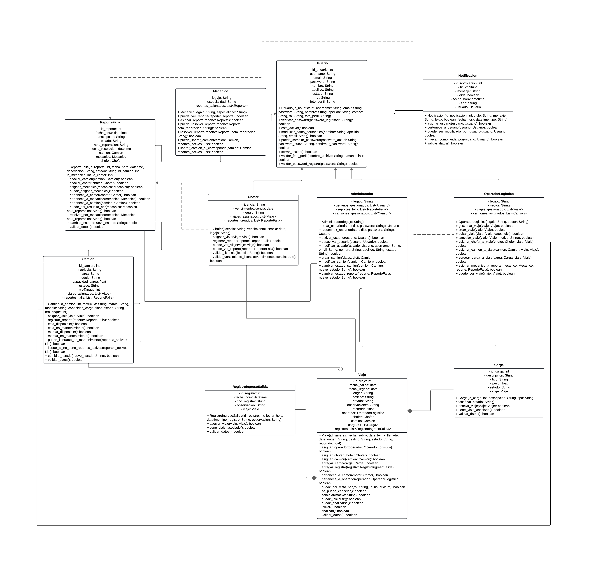
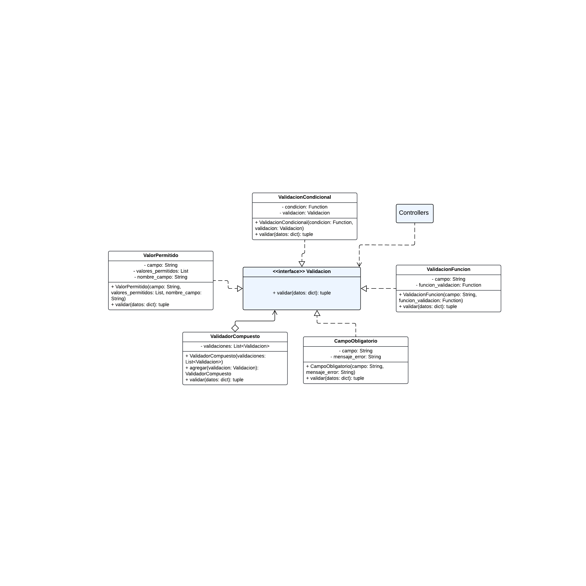
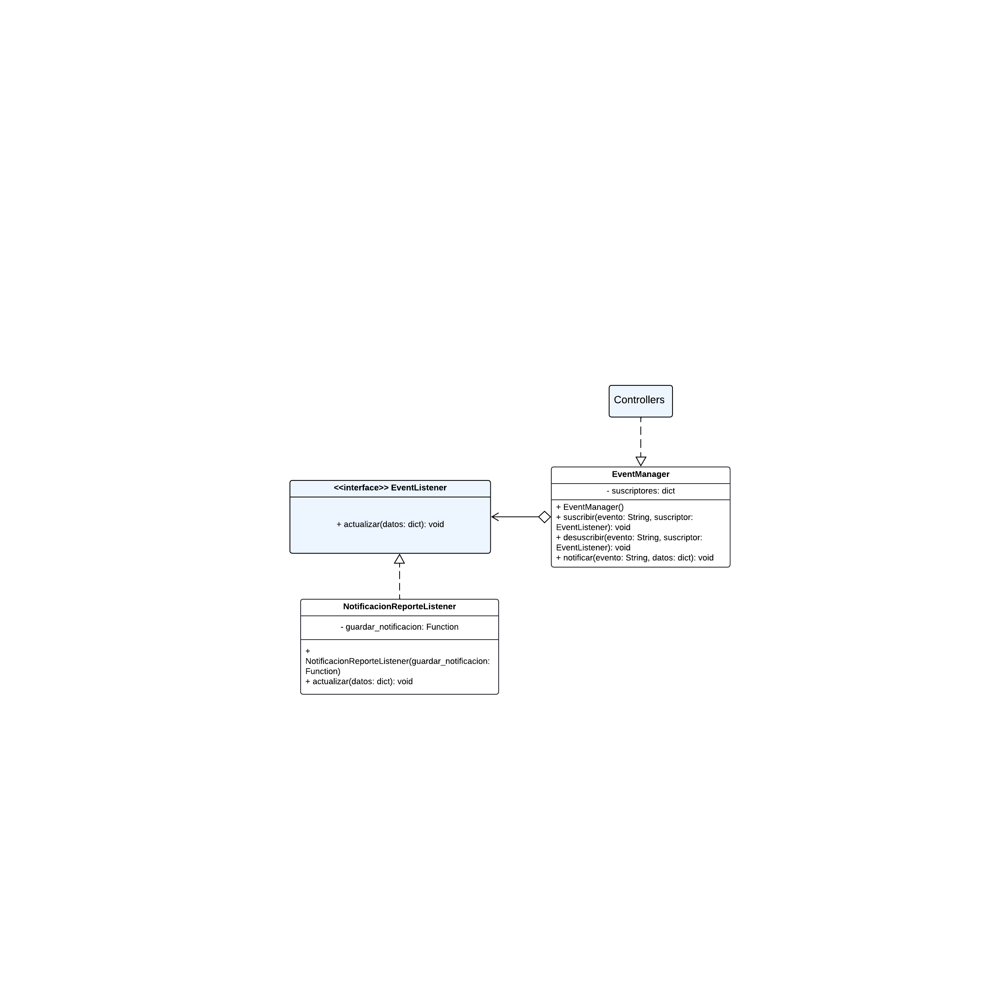

<div align="center">

# 🚛 Trukly

### Sistema de gestión de flota de camiones


</div>

---

## 📋 Descripción

**Trukly** es una aplicación web para la gestión de flotas de camiones. Permite administrar viajes, choferes, mecánicos, operadores logísticos y el seguimiento de reportes de falla, todo desde una interfaz moderna con dashboards y roles diferenciados por tipo de usuario.

El sistema sigue una arquitectura **MVC (Modelo - Vista - Controlador)** con una **API REST** desarrollada en Flask que se comunica con el frontend en React mediante JSON.

---

## 🧱 Tecnologías utilizadas

| Capa | Tecnología |
|------|-----------|
| Frontend | React 19, React Router 7, Bootstrap 5 |
| Build tool | Vite 8 |
| Backend | Python, Flask 3.1 |
| ORM | SQLAlchemy 2.0 + Flask-SQLAlchemy |
| Base de datos | MySQL / MariaDB |
| Autenticación | JWT (Flask-JWT-Extended + PyJWT) |
| Hash de contraseñas | bcrypt (Flask-Bcrypt) |
| Variables de entorno | python-dotenv |

---

## 📁 Estructura general del proyecto

```
trukly/
├── backend/                        # API REST — arquitectura MVC
│   ├── app.py                      # Punto de entrada
│   ├── db_instance.py              # Singleton de SQLAlchemy
│   ├── database/                   # Script SQL
│   ├── models/                     # (M) Modelos — tablas de la BD
│   ├── controllers/                # (C) Controladores — coordinan, validan y delegan
│   ├── routes/                     # Blueprints — conectan endpoints con métodos de los controladores
│   ├── src/                        # Clases de dominio — acá vive la lógica de negocio
│   │   └── observer/               # Patrón Observer (eventos y notificaciones)
│   ├── utils/
│   │   ├── auth_decorators.py      # Decoradores de autorización por rol
│   │   ├── input_sanitizer.py      # Sanitizador de inputs
│   │   └── validation_composite.py # Patrón Composite de validaciones
│   └── logs/                       # Logs generados automáticamente
├── frontend/                       # (V) Vista — React
│   └── src/
│       ├── components/
│       ├── pages/                  # Dashboards por rol
│       ├── context/                # Estado global de sesión
│       └── utils/
│           └── fetchConToken.js    # Fetch con JWT 
└── README.md
```

---

## 🏗️ Patrones de diseño aplicados

### Singleton — `db_instance.py`
Garantiza que exista una única instancia de `SQLAlchemy` en toda la aplicación. Se implementó con una metaclase (`DatabaseManager`) que controla la creación de instancias y reutiliza siempre la misma conexión a la base de datos.

### Composite — `utils/validation_composite.py`
Permite construir validaciones simples y combinarlas en validadores compuestos. Todas las validaciones implementan la interfaz `Validacion` con el método `validar()`.

| Clase | Rol |
|-------|-----|
| `Validacion` | Componente base (interfaz) |
| `ValidadorCompuesto` | Composite — agrupa y ejecuta validaciones en cadena |
| `CampoObligatorio` | Hoja — valida que un campo no esté vacío |
| `ValorPermitido` | Hoja — valida que el valor esté en una lista permitida |
| `ValidacionFuncion` | Hoja — delega la validación a una función externa |
| `ValidacionCondicional` | Hoja — ejecuta una validación solo si se cumple una condición |

### Observer — `src/observer/`
Desacopla la lógica de negocio de la generación de notificaciones. Cuando ocurre un evento (por ejemplo, un chofer crea un reporte de falla), el `EventManager` avisa a todos los suscriptores registrados sin que el servicio sepa quién está escuchando.

| Clase | Rol |
|-------|-----|
| `EventListener` | Suscriptor base (interfaz) con método `actualizar()` |
| `EventManager` | Publicador — gestiona suscriptores y dispara eventos con `notificar()` |
| `NotificacionReporteListener` | Suscriptor concreto — crea y guarda una `Notificacion` al recibir el evento |

### MVC
| Capa | Responsabilidad |
|------|----------------|
| **Modelo** (`models/`) | Representa las tablas de la base de datos via SQLAlchemy |
| **Vista** (`frontend/`) | Interfaz en React, consume la API REST |
| **Controlador** (`controllers/`) | Coordina el flujo: recibe el request, delega en las clases de dominio y responde |
| **Clases de dominio** (`src/`) | Contienen toda la lógica de negocio |

---

---

## 🔒 Seguridad

- **JWT** con expiración de 60 minutos. Al vencer, el frontend elimina el token y redirige al login automáticamente.
- **Decoradores de autorización por rol** en Flask (`@admin_required`, `@chofer_required`, `@operador_required`, `@mecanico_required`, `@usuario_required`, `@roles_required`). Cada endpoint protegido verifica que el token sea válido, que el usuario esté activo y que el rol del token coincida con el rol en la base de datos.
- **Sanitización de inputs** con `InputSanitizer`: limpieza de texto, emails, contraseñas, enteros y decimales antes de cualquier procesamiento. Usa `html.escape` para prevenir XSS.
- **Validación de contraseñas**: se aplican validacion al registrar o cambiar la contraseña.
- **Rutas protegidas en el frontend** con `ProtectedRoute`: si el usuario no tiene sesión o intenta acceder a una sección sin permiso, es redirigido automáticamente. Las páginas no encontradas y los accesos no autorizados tienen páginas dedicadas (`NotFoundPage`, `NoAutorizadoPage`).
- **CORS** configurado con Flask-CORS.

---

## 🗂️ Blueprints (rutas de la API)

Las rutas están organizadas en Blueprints de Flask, uno por módulo:

| Blueprint | Prefijo |
|-----------|---------|
| `auth_routes` | `/api/auth` |
| `administrador_routes` | `/api/administrador`, `/api/admin` |
| `chofer_routes` | `/api/chofer` |
| `operador_routes` | `/api/operador` |
| `mecanico_routes` | `/api/mecanico` |
| `camion_routes` | `/api/camion` |
| `viaje_routes` | `/api/viaje` |
| `reporte_routes` | `/api/reporte` |
| `perfil_routes` | `/api/perfil` |
| `notificacion_routes` | `/api/notificacion` |
| `registro_ingreso_salida_routes` | `/api/registro` |

---

## ⚙️ Instalación y configuración

### Requisitos previos

- Python 3.11 o superior
- Node.js 18 o superior
- MySQL 8 o MariaDB 10.4

---

### 🗄️ 1. Base de datos

1. Abrí XAMPP y asegurate de tener **Apache** y **MySQL** corriendo.
2. Entrá a `http://localhost/phpmyadmin`.
3. Creá una base de datos llamada `trukly`.
4. Seleccioná esa base de datos, entrá a la pestaña **Importar**.
5. Elegí el archivo `backend/database/Script.sql` y hacé clic en **Continuar**.

> Esto crea todas las tablas y carga los datos de prueba automáticamente.

---

### 🐍 2. Backend (Flask)

```bash
# Entrar a la carpeta del backend
cd backend

# Crear el entorno virtual
python -m venv venv

# Activar el entorno virtual
# En Windows:
venv\Scripts\activate
# En Mac/Linux:
source venv/bin/activate

# Instalar dependencias (se instalan todas automáticamente)
pip install -r requirements.txt

# Configurar las variables de entorno
# Crear un archivo .env con el siguiente contenido:
```

```env
DB_HOST=localhost
DB_USER=root
DB_PASSWORD=
DB_NAME=trukly
DB_PORT=3306
SECRET_KEY=clave_secreta_aqui
```

```bash
# Iniciar el servidor
python app.py
```

El backend queda corriendo en: `http://localhost:5000`

---

### ⚛️ 3. Frontend (React)

```bash
# Entrar a la carpeta del frontend
cd frontend

# Instalar dependencias
npm install

# Iniciar la aplicación
npm run dev
```

El frontend queda corriendo en: `http://localhost:5173`

---

## 👥 Usuarios de prueba

> Todos los usuarios comparten la misma contraseña: **`12345678a`**

| Usuario | Rol |
|---------|-----|
| `admin1` | Administrador |
| `chofer1` | Chofer |
| `Operador1` | Operador Logístico |
| `Mecanico1` | Mecánico |

---

## 🔐 Roles del sistema

| Rol | Permisos principales |
|-----|---------------------|
| **Administrador** | Gestión total del sistema, usuarios, camiones, viajes, reportes y estadísticas |
| **Operador Logístico** | Crear y gestionar viajes, asignar choferes y camiones, ver reportes y estadísticas |
| **Chofer** | Ver sus viajes asignados, reportar fallas, ver sus estadísticas |
| **Mecánico** | Ver y gestionar reportes de falla asignados, registrar reparaciones |

Cada rol tiene su propio dashboard con las secciones correspondientes. Todos los usuarios pueden editar su perfil y ver sus notificaciones.

---

## 🚚 Datos de prueba incluidos

- **6 camiones** (4 disponibles, 2 en mantenimiento)
- **4 viajes** (pendientes, finalizado y cancelado)
- **2 reportes de falla** (pendiente y en revisión)
- **3 notificaciones**

---

## 📐 Diagramas

### Diagrama de clases


### Patrón Composite


### Patrón Observer


<div align="center">
  <sub>Desarrollado por Juan Del Pozo y Florencia Bergman— Trukly </sub>
</div>
